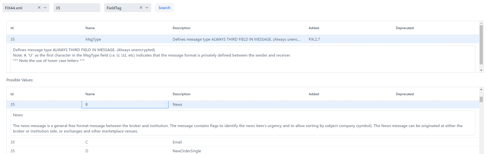
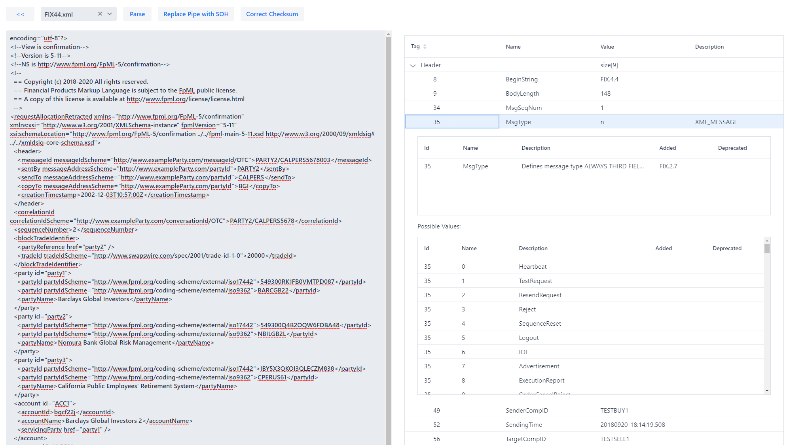
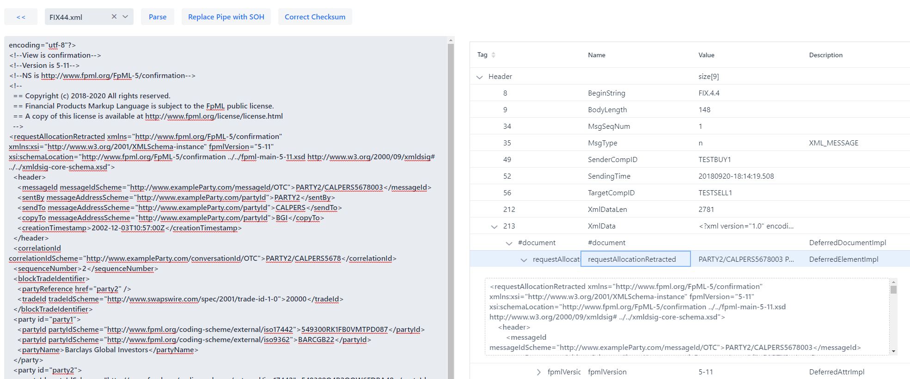
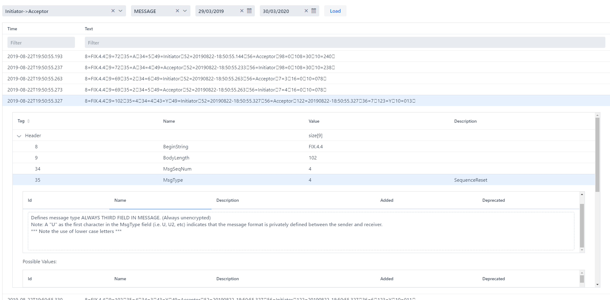

# JFIXTools

This set of tools builds on top of 
- QuickFixJ: https://github.com/quickfix-j/quickfixj
- FIX Repository: https://www.fixtrading.org/standards/fix-repository/ 

It provides some sample code for Cucumber-based testing of FIX messages and sessions. It also provides 
Spring Boot 2 enabled services for loading the FIX Repository, FIX Logs (either from File or Database)
and a FIX Message parser. 

Like most projects, documentation is a work in progress. Here are some screenshots of the included 
VaadinApplication. You can simply clone and run to view the embedded Database and files with 
sample fix logs.

While a hosted version of this project would be useful, there are already many standard FIX parsers out there.
This project allows people to input their own Dictionaries and FIX Message sources so that they
can host the application internally and not worry about sharing live trading information with
external websites.

## Sample Web Application

The sample application is written using Vaadin, currently without any special stylesheets or fanciness.
This serves the purpose of providing a usable application, which is easy to code, and also easy to read for
a Java Developer who may not be familiar with Angular/Bootstrap etc. If anyone would care to 
contribute a slick JavaScript-based UI, I would love to chat!

### Screenshots
#### Repository search page

#### Message Parsing

#### Message Parsing with Embedded XML

#### Log viewer (Database and File) with embedded Message view

### How to configure the sample application

The application.properties present in jfixtools-ui-vaadin demonstrates how to set up a source from both File and Database logs. 
It is important to note that the 'sessionID' part of the dictionary.mappings and the 'logSources' must contain the same fields
or else the dictionary will not be loaded when attempting to parse the text of a fix message.

## Performance Testing
Many thanks go to YourKit for providing me with an Open-Source license which has allowed me to nail
down some nasty performance issues with the QuickFixJ code-generator as well as fixing my own
code!

YourKit supports open source projects with innovative and intelligent tools for monitoring and profiling Java and .NET applications.
YourKit is the creator of [YourKit Java Profiler](https://www.yourkit.com/java/profiler/), [YourKit .NET Profiler](https://www.yourkit.com/.net/profiler/), and [YourKit YouMonitor](https://www.yourkit.com/youmonitor/)

## Licensing?
I'm not precious. It's released under GPL3. Do what you like with it. Copy it, rip it apart, extend it, make it better. I would ask that you let me know if you've done any of that, but you don't have to.

Cheers,

Beirti
